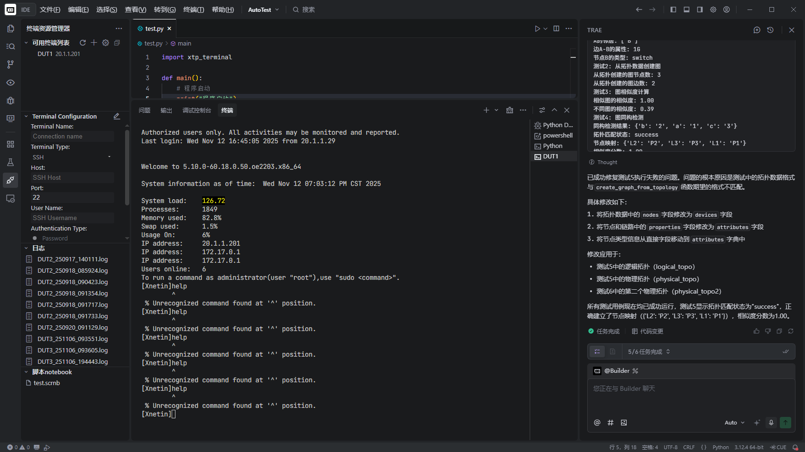

== 1. 简介

XTP是一个开源测试平台，当前包含以下几个部分：

*   xtp-terminal ： 实现终端访问的vscode插件，支持建立和保存SSH、Telnet、Serial连接信息；可以为每个终端连接指定各自的名称；

*   xtp-agent： 提供脚本访问终端的代理，当打开多个vscode实例时，每个实例中运行的脚本基于本实例的工作目录访问不同的终端，不会相互影响；

*   xtp-python： 通过脚本访问终端的Python库，提供打开/关闭终端窗口，向终端窗口发送命令并获取命令回显信息，获取指定行数的终端显示信息等功能；
  
以下几个部分处于规划当中：
  
*   xtp-robot： 基于PyTest实现的自动化测试框架，支持基于图形的拓扑匹配功能，可以基于逻辑拓扑编写脚本并在运行时映射到实际的物理环境，减少脚本对物理环境的依赖；

*   xtp-center：自动化测试运行管理系统，集中管理自动化测试环境和测试脚本，支持并发调度大规模自动化测试任务运行；

下面是完整的系统架构图
  
image::images/xtp-framework.png[]

== 2. xtp-terminal

xtp-terminal以vscode插件方式提供，可以方便的集成到任意的vscode开发环境：
  
image::images/run_in_vscode.png[]

也适用于TRAE开发环境：

  
加载后可以点击“+”图标添加新的终端连接：

image::images/add_terminal.png[]
  
添加完成后，点击“连接”按钮即可连接到指定的终端：
  
image::images/connect_terminal.png[]

xtp-terminal还支持以下特性：

*  保存终端显示信息到日志文件
*  创建简单的终端命令下发脚本
  
xtp-terminal在开发中借鉴了link:https://github.com/littrick/vscode-serial-terminal[vscode-serial-terminal]的部分实现，如果您需要一个只有Serial连接的更简单的工具，可以下载这个工程作为参考。

== 3. xtp-agent

xtp-agent是一个Golang项目，采用ZMQ通信的Router模式实现多个客户端访问多个终端窗口的消息分发和结果返回。xtp-terminal启动后以当前工作目录作为标识注册到xtp-agent。xtp-python中访问xtp-terminal的终端窗口时，会查找一个一个和当前脚本路径匹配最长的工作路径，将消息发给对应的xtp-terminal进行处理。如果无法找到匹配的xtp-terminal，则选取第一个作为目标对象：

image::images/structure.png[]

== 4. xtp-python

xtp-python实现了终端窗口操作的Python语言接口，可以直接在脚本中调用，也是后续xtp-robot开发的设备命令行基础接口。